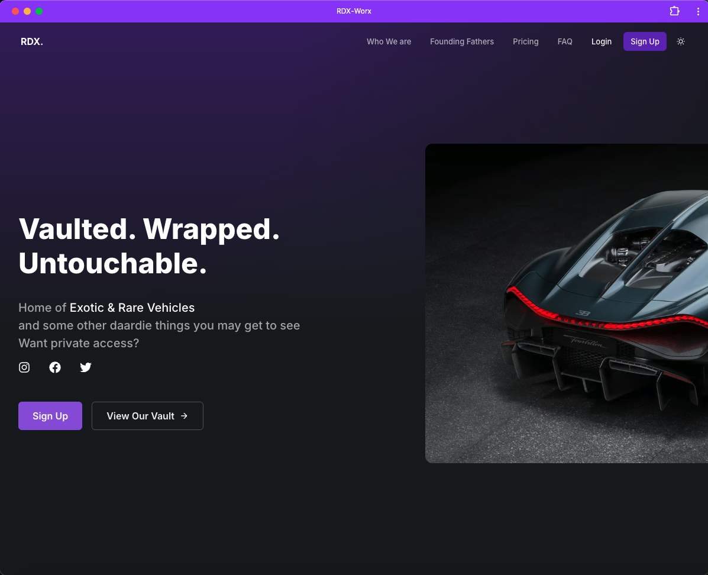
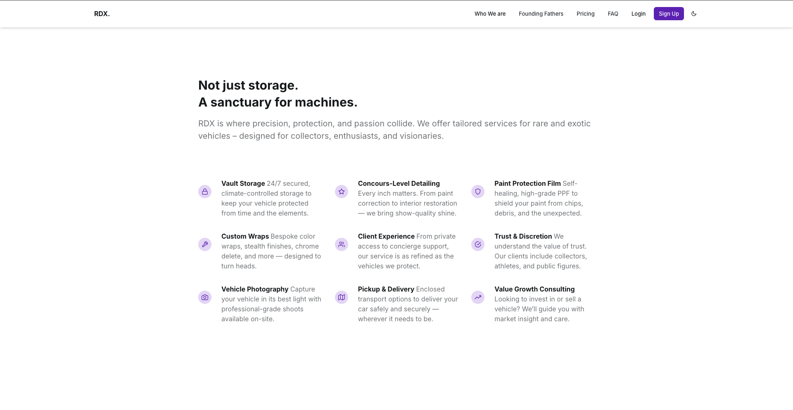
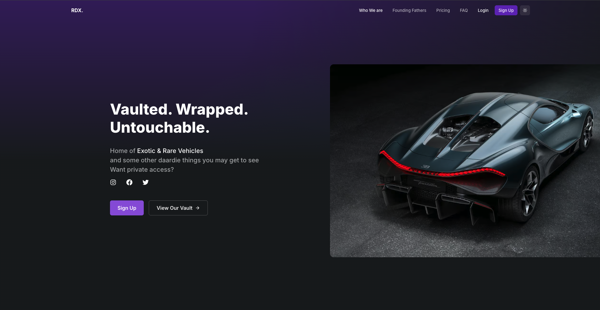
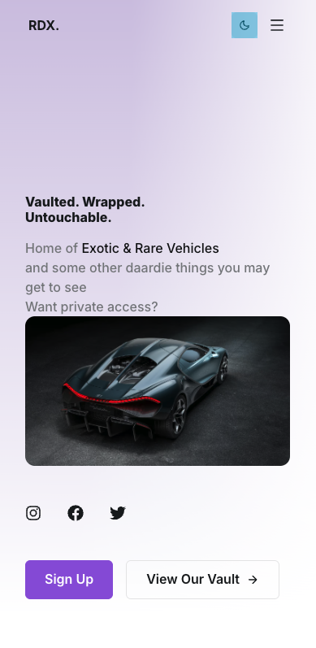

"""
# "RDX_WORX – Vaulted. Wrapped. Untouchable."

**"RDX_WORX"** is a premium Next.js-powered PWA and landing experience tailored for the rare and exotic vehicle space. Built with Saas UI and Chakra UI, it's more than just a site — it’s your digital gateway to private vehicle vaulting, precision detailing, PPF, custom wraps, and more.

[🔗 **"View Live Demo"**](https://rdx-worx.vercel.app/)

---

## "🧰 Tech Stack"

- "Next.js (App Router)"
- "Chakra UI"
- "Saas UI"
- "TypeScript"
- "React Icons"
- "Fully responsive & mobile-friendly"

---

## "🚘 Features"

- "**Hero Section** – Bold intro with CTA and social integration"
- "**Highlights & Feature Blocks** – Showcasing services and standout offerings"
- "**Testimonials** – Client stories from collectors & enthusiasts"
- "**Pricing Tables** – Flexible service packages"
- "**Vault Access Sign-up Flow** – Ready to connect with potential clients"
- "**FAQ Section** – Answers to everything that matters"

---

## "🔒 RDX_WORX Services Include"

- "Secure Vault Storage (climate-controlled & discreet)"
- "Premium Detailing & Paint Correction"
- "Paint Protection Film (PPF)"
- "Ceramic Coating"
- "Custom Vehicle Wrapping (chrome delete, stealth, color change)"
- "Vehicle Photography"
- "Pickup & Delivery (enclosed transport)"
- "Value Growth & Collection Consulting"

---

## "🔧 Getting Started"

"Clone the repo and install dependencies:"

"Then open http://localhost:3000 in your browser."

---

## "🧭 Configuration"

"All content is easily editable via the /data directory:"

- `"faq.ts"` – "For the FAQ section"
- `"pricing.ts"` – "Your service packages"
- `"testimonials.ts"` – "Client feedback"

"Component-level edits can be made in /components."

"Run the development server: pnpm dev"

---

## "🧠 Learn More"

- ["Saas UI Documentation"](https://saas-ui.dev/docs)
- ["Next.js Documentation"](https://nextjs.org/docs)
- ["Chakra UI Documentation"](https://chakra-ui.com/docs)

---

## "🚀 Deploy on Vercel"

"The fastest way to go live: [Vercel](https://vercel.com/)"

"Just connect your repo, and you're set."

---

## "📸 Previews"

**"Hero Desktop View"**  

**"Mobile Vault Preview"**  

---

> "Vaulted. Wrapped. Untouchable. – RDX_WORX"
"""
